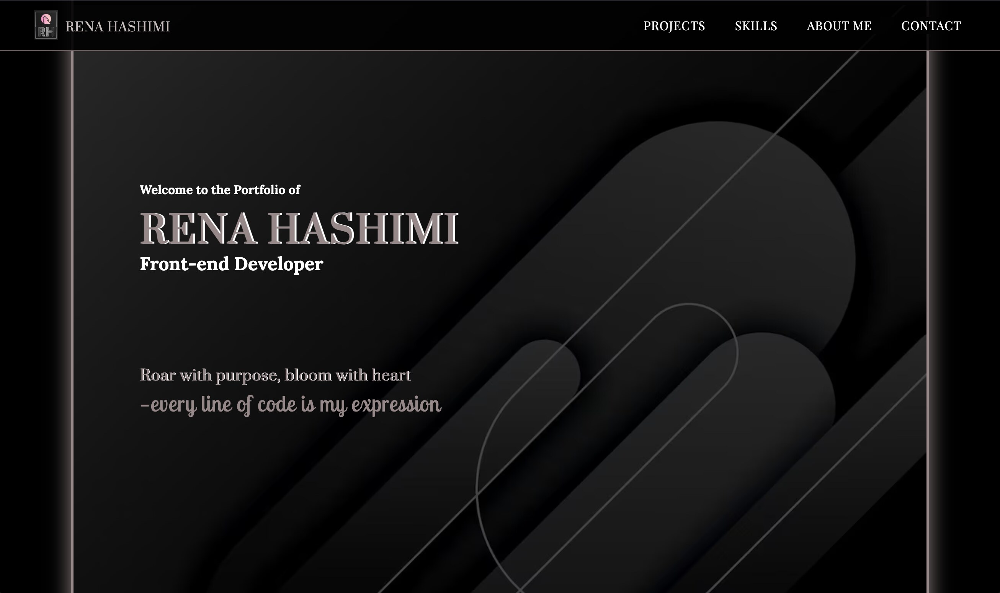

# Portfolio2

### 

Welcome to my portfolio! Here, I showcase various projects I've worked on, demonstrating my skills in front-end development, including React, JavaScript, and CSS. Each project is a reflection of the knowledge and experience I've gained throughout my learning journey.

## Brief

In this assignment, we will be documenting three prior submissions from the first year:

- Semester Project 2
- JavaScript Frameworks CA
- Project Exam 2

## Live Demo

[LINK - Netlify ](https://portfolio-renahashimi.netlify.app/)

## Installing

In the project directory, you can run:

### Cloning the Repository

To get started with the project, first clone the repository by running the following command:

```bash
git clone https://github.com/renahashimi/portfolio2.git
```

#### `npm start`

Runs the app in development mode.  
Open [http://localhost:3000](http://localhost:3000) to view it in your browser.

#### `npm run build`

Builds the app for production to the `build` folder. It optimizes the build for the best performance.

---

## Projects

Below is a collection of the projects I’ve built using different technologies. Click on the live demo to view or explore the source code on GitHub.

### 

### **Holidaze - Project Exam 2**

A holiday venue booking platform built with React and Tailwind CSS, featuring dynamic, responsive UI and API integration for venue data.

**Technologies used:**

- React
- Tailwind CSS
- Vite
- API

[Demo](https://holidaze-pe2-rh.netlify.app/)  
[Code](https://github.com/renahashimi/holidaze-pe2.git)

---

### 

### **Lunaura - JavaScript Frameworks**

An eCommerce site built with React, Tailwind CSS, and Styled-components, allowing users to browse products, add to the cart, and check out.

**Technologies used:**

- React
- Tailwind CSS
- Vite
- Styled-components
- API

[Demo](https://lunaura-rh-reactapp.netlify.app)  
[Code](https://github.com/renahashimi/fed-frameworks-ca.git)

---

### 

### **Midas Touch - Semester Project 2**

A web auction platform where users can list items, place bids, and manage auctions, simulating a real auction environment.

**Technologies used:**

- JavaScript
- Bootstrap
- Sass
- HTML
- CSS

[Demo](https://midastouch-rh-sp2.netlify.app/)  
[Code](https://github.com/renahashimi/SemesterProject2.git)

---

## Contact

I'm always open to new opportunities and collaborations. Feel free to reach out to me through the following platforms:

- **Email**: [Send me an email](mailto:r.ah@live.no)
- **Instagram**: [Follow me on Instagram](https://www.instagram.com/renahashimi/)
- **GitHub**: [Check out my GitHub](https://github.com/renahashimi)

Feel free to connect with me via these links!

## Referances

[Background image](https://www.freepik.com/free-vector/abstract-black-shapes-background-design_14649137.htm#fromView=search&page=1&position=28&uuid=0e09ed7c-db09-47eb-b4ab-8b9dce7788f5&query=black)

This background image was sourced from Freepik and used for design purposes.
